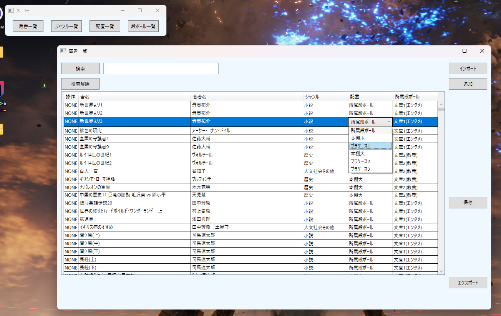
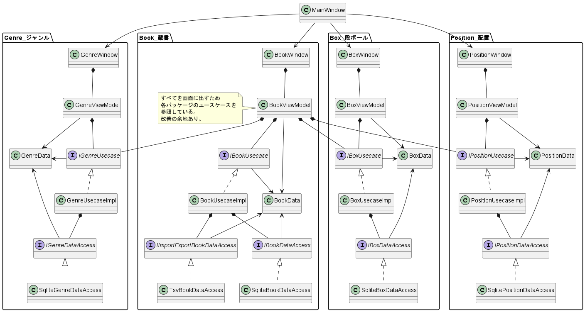

# 蔵書管理用デスクトップアプリケーション
## 画面イメージ

## できること
+ 蔵書の現在の配置場所と<strong>読み終わったら戻す段ボール</strong>の両方管理(この機能があるアプリが見つからなかったため作った)
+ 蔵書の題名・著者・ジャンルの情報を管理
+ 上記の情報を一覧表示
+ 題名で検索(他の列での検索は工事中...)
+ 各情報で蔵書をソート(WPFで表つくったら勝手に入ってるやつ)

## 重視したこと
+ <strong>これが完成しないといつまでたっても本の整理ができない</strong>ため、開発速度を重視した
+ テスト駆動開発をやってみたかったため、やってみた
+ GitHub Actionsをやってみたかったため、やってみた
+ クリーンアーキテクチャ的な依存関係の整理をやってみたかったため、やってみた
+ SQLiteを試してみたかったため、やってみた

## 重視しなかったこと
+ メインPC上でのみ動けばよいと考えたためデスクトップアプリケーションとした 
  (この判断は誤りであり、後に別室のPCとデータ連携したくなったためWebアプリへの移行を検討中)
+ 書籍の件数は2024年9月現在で932冊程度のため、将来的に10000冊を超えるような事態は考えづらい 
  データ量を鑑み、処理効率はあまり考慮しなかった(全件*全件の二重ループをしても高々O(10^8)のため、大した問題にはならないはず...)
+ 上記2点により、データベースアクセスは並行処理を全く考慮していない
+ 想定利用者は作者1名のため、ユーザ等の概念はない

## 中身の構造

